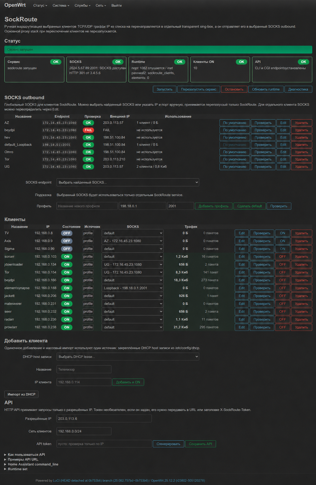

# SockRoute

SockRoute - это веб-сервис для LuCI на OpenWrt, который позволяет вручную отправлять выбранных LAN-клиентов в выбранный SOCKS outbound без перезапуска основного прокси-стека.



Проект устанавливает:

- LuCI-страницу `Сервисы -> SockRoute`;
- отдельный прозрачный `sing-box`;
- nftables set для быстрого включения и выключения клиентов;
- локальный HTTP API для Home Assistant и других LAN-интеграций;
- именованные SOCKS outbound профили;
- живые счётчики nft для клиентов, которые реально попали в SockRoute.

## Быстрая установка

Запуск на OpenWrt:

```sh
wget -O /tmp/sockroute-install.sh https://raw.githubusercontent.com/Kemper51rus/SockRoute/main/install.sh
sh /tmp/sockroute-install.sh
```

Короткий вариант:

```sh
wget -O - https://raw.githubusercontent.com/Kemper51rus/SockRoute/main/install.sh | sh
```

Установщик:

- ставит нужные пакеты через `apk` или `opkg`;
- делает бэкап существующих файлов SockRoute в `/root/sockroute-backups/<timestamp>`;
- устанавливает службу, API и LuCI-файлы;
- создаёт `/etc/config/sockroute` и `/etc/config/sockroute_api`, если их ещё нет;
- использует hook-цепочки PassWall2, если они есть, иначе подключается к стандартным цепочкам `fw4`;
- включает и запускает `/etc/init.d/sockroute`;
- чистит LuCI cache и перезапускает `rpcd`/`uhttpd`.

## Требования

- OpenWrt с nftables/firewall4.
- `sing-box`.
- Доступный SOCKS5 endpoint. Он может быть локальным, например `127.0.0.1:1080`, или находиться на другом устройстве в LAN.
- nft hook-цепочки:
  - предпочтительно: `inet passwall2 PSW2_NAT` и `inet passwall2 PSW2_MANGLE`;
  - запасной вариант: `inet fw4 dstnat` и `inet fw4 mangle_prerouting`.

## Настройка

Откройте LuCI:

```text
Сервисы -> SockRoute
```

Или используйте CLI:

```sh
/usr/libexec/sockroute socks-list
/usr/libexec/sockroute set-socks 127.0.0.1 1080
/etc/init.d/sockroute restart
```

Добавить клиента:

```sh
/usr/libexec/sockroute add-named 192.168.1.100 "Клиент"
```

Выключить маршрутизацию клиента через SockRoute:

```sh
/usr/libexec/sockroute del 192.168.1.100
```

Удалить клиента из сохранённого профиля:

```sh
/usr/libexec/sockroute delete-client 192.168.1.100
```

## HTTP API

Endpoint по умолчанию:

```text
http://192.168.1.1/cgi-bin/sockroute-api?ip=192.168.1.100&action=status
```

Действия:

- `status`;
- `on`;
- `off`;
- `toggle`.

Опциональный выбор outbound:

```text
http://192.168.1.1/cgi-bin/sockroute-api?ip=192.168.1.100&action=on&outbound=Tor
http://192.168.1.1/cgi-bin/sockroute-api?ip=192.168.1.100&action=on&outbound=192.168.1.10:1080
http://192.168.1.1/cgi-bin/sockroute-api?ip=192.168.1.100&action=on&outbound=default
```

Доступ к API ограничивается в `/etc/config/sockroute_api`:

```sh
uci add_list sockroute_api.main.allowed_source_ip='192.168.1.2'
uci set sockroute_api.main.allowed_target_cidr='192.168.1.0/24'
uci commit sockroute_api
```

Если задан `sockroute_api.main.token`, передавайте его как `token=...` или HTTP-заголовок `X-SockRoute-Token`.

## Home Assistant

LuCI-страница генерирует `command_line` YAML по текущему списку клиентов.

Пример:

```yaml
command_line:
  - switch:
      name: "Клиент SockRoute"
      unique_id: sockroute_client
      command_state: >-
        curl -fsS --max-time 10 "http://192.168.1.1/cgi-bin/sockroute-api?ip=192.168.1.100&action=status"
      value_template: "{{ value == 'ON' }}"
      command_on: >-
        curl -fsS --max-time 15 "http://192.168.1.1/cgi-bin/sockroute-api?ip=192.168.1.100&action=on"
      command_off: >-
        curl -fsS --max-time 15 "http://192.168.1.1/cgi-bin/sockroute-api?ip=192.168.1.100&action=off"
```

После изменения `configuration.yaml`:

```sh
ha core check
ha core restart
```

## Диагностика

```sh
/etc/init.d/sockroute status
/usr/libexec/sockroute health
/usr/libexec/sockroute list
/usr/libexec/sockroute check-client 192.168.1.100
nft list set inet fw4 sockroute_clients
logread -e sockroute
logread -e sockroute-api
```

## Удаление

```sh
/etc/init.d/sockroute stop
/etc/init.d/sockroute disable
/usr/libexec/sockroute teardown
rm -f /etc/init.d/sockroute /usr/libexec/sockroute /usr/libexec/sockroute-api /www/cgi-bin/sockroute-api
rm -f /usr/share/luci/menu.d/luci-app-sockroute.json
rm -f /usr/share/rpcd/acl.d/luci-app-sockroute.json
rm -f /www/luci-static/resources/view/sockroute.js
```

Конфиги специально не удаляются командами выше. Если нужно удалить и их:

```sh
rm -f /etc/config/sockroute /etc/config/sockroute_api
```

## Подробности

Подробное описание схемы, LuCI, API, SOCKS outbound и диагностики: [docs/reference.md](docs/reference.md).
